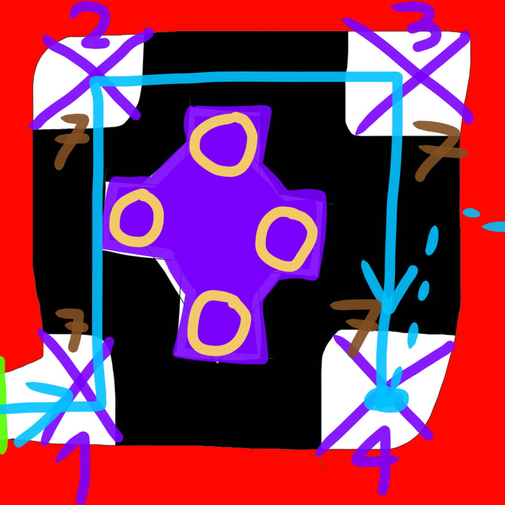

# be-green-charlie-project
be-green-charlie-project created by GitHub Classroom
# Membres
VALA Sylvain - ALLARD Jeff - BEYER Astrid
# Comment jouer
- La souris pour orienter la caméra
- La touche "Espace" pour sauter
- La touche "f" pour tirer la graine selectionné
## Si votre clavier est en azerty
- Les touches "z","q","s","d" pour les déplacement (selon l'angle de la caméra)
- Les touches "x","c","v","b","n" pour selectionner les graines a planter
## Si votre clavier est en qwerty
- Les touches "w","a","s","d" pour les déplacement (selon l'angle de la caméra)
- Les touches "1","2","3","4","5" pour selectionner les graines a planter
# Description
## Gameplay
- Le joueur se déplace en marchant et saute. Il ne dispose pas de barre de vie et meurt en un coup, réapparaît au début du niveau quand il meurt et recommence tout au bout des vies épuisées.
- Le joueur doit lancer des graines qui font pousser des plantes pour s’en servir comme plateforme. Le joueur a un nombre limité de graines pour chaque plante mais qui se réinitialise à chaque début de monde.
- Il y a une plante pour servir de plateforme, une qui permet de sauter haut, une comme plateforme sur l’eau, une pour grimper un mur, une pour aller d’une mur à l’autre, une pour donner du raisin qui sert comme arme légère, une pour donner des noix de Coco qui sert comme arme lourde

nom graine                  | description               | image de la graine une fois poussé
:-------------------------:|:-------------------------:|:-------------------------:
Mur/buisson| plante qui peut se planter dans la terre, sert de platforme au joueur pour attendre de nouvelles hauteurs mais aussi pour servire d'extenssion de platforme |
Saut| plante qui peut se planter dans la terre, sert de petite platforme. Faire l'action de saut sur cette platforme vous fera sauter trois fois plus haut| 
Nénuphar| plante qui peut se planter uniquement dans l'eau, sert de petite platforme pour se déplacer sur l'eau de manière plus sereine | 
Vigne| plante qui peut se planter dans la terre, sert a générere des munitions de type raisin. Les raisins sont concidéré comme étant une munition légère | 
Cocotier | plante qui peut se planter dans la terre, sert a générere des munitions de type noix de coco. Les noix de coco sont concidéré comme étant une munition lourde | 

## Game Design
- Monde 1 : la forêt, pas d’ennemis, graines de buisson et de plantes ressort, pas de Boss

level | concept          |  model 3D | rendu ingame
:-------------------------:|:-------------------------:|:-------------------------:|:-------------------------:
1 : |  |   | 
2 : |  |   | 
3 : |  |   | 
4 : |  |   | 
5 : |  |   | 

- Monde 2 : le ravin/la carrière, pas d’ennemis mais des pierres peuvent chuter, gouffres, graines de lianes et de lierre, Boss qui attaque avec bras élancé : il faut monter dessus puis sauter sur la tête au centre

level | concept          |  model 3D | rendu ingame
:-------------------------:|:-------------------------:|:-------------------------:|:-------------------------:
1 : |  |   | 
2 : |  |   | 
3 : |  |   | 

level 4 | partie 1 | partie 2 | partie 3
 :-------------------------:|:-------------------------:|:-------------------------:|:-------------------------:
Niveau coupé en trois partie encore qu'a l'état de concept | |  | 

level boss | concept
:-------------------------:|:-------------------------:
Un niveau qui conclue le monde deux, qu'a l'état de concept | 

- Monde 3 : la scierie, petits robots, cours d’eau, graines de nénuphar et de raisin, Boss qui attaque à distance : il faut lancer du raisin en son cœur quand il s’arrête

level 1 concept | level 2 concept | level 3 concept | level 4 concept | level 5 concept
:-------------------------:|:-------------------------:|:-------------------------:|:-------------------------:|:-------------------------:
 | |||

- Monde 4 : le centre de traitement, petits et grands robots, cours d’eau contaminée, plateformes mécaniques, graines de noix de Coco, Boss qui attaque à distance : il faut le bloquer avec des mécanismes à l’aide de petites projectiles 
- Monde 5 : la machinerie, petit et grands robots, plateformes mécaniques, Boss final : le bloquer avec des plantes diverses puis viser la tête/le cœur de l’armure
## Histoire/scénario
Charlie, l’arbre qui vivait paisiblement dans sa forêt en bord de ville, est soudain réveillé par un camion-citerne qui vide des produits chimiques. Il change de forme et se rapproche d’un homme arbre, mais juré de se venger contre ceux qui ont pollué sa forêt : l’entreprise Industrie Commerciale Kash.
En voulant rattraper le camion citerne, il glisse et dévale une pente et se retrouve dans le cœur de la forêt, il décide de partir vers la où il a vu partir le camion : l’est. Pour cela il récupère des graines et il découvre qu’il peut les lancer à distance et celles-ci poussent aussitôt en des plantes qui peuvent l’aider pour avancer.
Il traverse le paysage et voit de plus en plus le paysage déformé par les mêmes responsables : ICK. D’abord des machines qui déboisé une forêt puis une centre de traitement chimique qui vide les déchets dans la rivière, puis la base principale de ICK avec un complexe de machines.
Charlie arrive enfin face au chef et responsable : M. Kash le Directeur de ICK, ou DICK. Alors que Kash s’échappe dans une autre pièce pour entrer dans une armure-machine, les deux se battent dans un duel.
Charlie arrive finalement à le battre, mais Kash lui fait la révélation : c’est lui qui lui a donné la vie une dizaine d’années plus tôt, en urinant sur la petite pousse qu’il était. Pris de désespoir, Charlie se fige et se fait assommé, puis enfermé par Kash, alors que toutes les plantes que Charlie a planté en chemin sont en train de reprendre le contrôle des installations de ICK.
# Déroulement du projet (dans les grandes lignes)
- L'idée originale du projet nous est venu en mars-avril, à ce moment nous avions seulement en tête un jeu de plateforme où le personnage devait tirer des graines pour faire pousser des plantes qui le permettrait d'avancer.
- Mi-avril (après nos examens en fait), nous avons commencé à concrétiser l'idée. Nous sommes partis sur un jeu de plateforme en total 3D niveau par niveau, avec l'idée de partir sur cinq grands niveaux, une nouvelle plante débloquée à chaque fois et un boss final. Nous avons créé le dépôt gitlab avec comme nom de projet et de jeu : Project Charlie.
- Fin avril, nous avons eu une idée un peu plus précise du gameplay avec le système de vie, et nous avons choisi de diviser chaque grand niveau devient un "monde" divisé en plusieurs sous-niveaux séparés, avec un système de spawn/respawn. C'est à ce moment que nous avons eu nos premiers croquis puis modèles de niveaux du monde 1, ainsi que les premiers modèles d'éléments. Il a fallu faire les animations du personnage ainsi que réadapter la taille des niveaux, et enfin décidé de garder un système niveau entouré de murs infranchissables avec une entrée et une sortie. 
- Début mai, nous avons eu nos premiers problèmes au niveau du code, avec des soucis concernant la caméra, les déplacement et les animations du personnage, à ce moment le jeu était simplement composé du premier niveau vierge et du personnage. L'animation du personnage a été désactivée dans un premier temps pour empêcher une animation de saut en boucle, la caméra suivait les mouvement et les rotations du personnages et les mouvements ont été adaptés, le personnage pouvait alors atteindre tout le niveau. L'histoire a commencé à être plus développée, avec l'idée d'un homme-arbre qui cherchait à se venger d'un individu qui polluait son habitat.
- Depuis et jusqu'à maintenant, nous avons progressivement ajouter des modèles 3D des niveaux suivants et d'autres éléments, nous avons appliqué des textures et des animations sur certains éléments, chaque modèle a été revu, parfois beaucoup de fois dans certains cas. L'interface a été améliorée pour permettre la sélection d'une graine à lancer, le buisson comme plateforme simple, un plante ressort pour projeter avec un grand saut, du lierre pour grimper, une arbre avec du raisin pour lancer des grains de raisin, une liane pour passer d'un mur à l'autre et il était prévu de rajouter la noix de coco comme projectile lourd. La caméra et les mouvements du personnage ont été régulièrement améliorés et adaptés au besoin, notamment concernant la visée et le lancer d'une graine. Enfin les niveaux du premier monde ont été peuplés d'éléments du décor.
- Au terme du temps imparti, seul les niveaux du premier monde et les trois premiers du deuxièmes mondes ont été pleinement modélisés avec leur décor, le quatrième niveau a été modélisé mais sans éléments, le dernier niveau de monde deux et le troisième monde restent seulement à l'état de croquis, les deux autres restent à l'état de concept. Aucun boss ni ennemi n'a pu être modélisé ni dessiné même s'ils étaient prévus.
# Hebergement du jeu:
[https://gamesonweb.github.io/be-green-charlie-project/](https://astrid-beyer.gitlab.io/projet-charlie/)
# Video de Gameplay commenté:
https://youtu.be/EMxZdXWLT5Q
# Code source du jeu:
[https://gitlab.com/Astrid-Beyer/projet-charlie/](https://gitlab.com/Astrid-Beyer/projet-charlie)
# Légende des concepts de niveau:
[Légende qui permet de lire et de comprendre les concepts de niveau](./drawings/legende.md)
